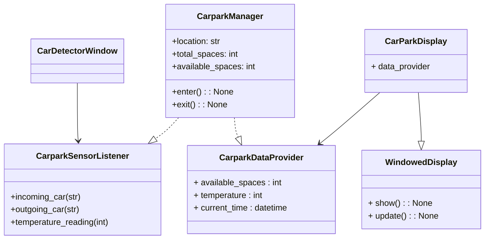

 # Agile High-Level Design (HLD) for Parking Space Availability System

This high-level design provides an outline of the main objects and classes. This information serves as a starting point for the junior developer responsible for implementing the code.

## Additional Requirement: PEP8 Compliance

The project must follow PEP8, the Python style guide, to ensure consistency and readability throughout the codebase.

## Objects and Classes

### Class: ParkingLot

Attributes:

- location: The parking lot's location.
- total_spaces: The total number of parking spaces.
- cars: Information about cars currently parked at the carpark.

Methods: 
- `__init__(self, config)`: Initialize the ParkingLot object with the given configuration.
- `incoming_car(self,license_plate)`: Register a car entering the parking lot.
- `outgoing_car(self,license_plate)`: Register a car leaving the parking lot.

### Class: Display

Attributes:

Methods: 

- `__init__(self)`: Initialize the Display object with a SenseHAT instance.
- `update(self)`: Refresh the display

## Class Diagram

Paste the document below into Mermaid (https://mermaid.live).
or, try this link: https://mermaid.live/edit#pako:eNqFU01v2zAM_SsCTwmWGknrLI4OuzTHbSiww4AhgMHZrCPMlgyK7sey_PfJSVrIXoIJPkh8j0-PNLWHwpUEGooavd8YrBibrVVh3SNvSKgQx9-NLd2zurn51Edb5F_fyHrHn40XssTvCQ8B2hjf1vgaszco-MDuyZQRtwe-oMWKWCXJn_9JX6Nf1B76CORTBVSegyfiseYxpPYnsF8flN-558lUq6_OUhzv2hKFJlMVQ4dYduRioBpyMW8Hpse549KGAviEpsafNeW-xYJ8sGGsxAyhpiVG6Zj-BYuOmazkYpoe7Uvpt5edjIYg-LjuePjvBp6NLVxjbJUXyBMvPI0w10nlrmBRITkTloE2CeVM1XUXb2MSX1-7AsU4q1XQj-WdYH3u4rhP4y6P8dBC4gvTQS9GhuEDzKBiU4IW7mgGDXGD_RGOHrcgOwr9Bx22JT1iV8sWtrZPa9H-cK55y2TXVTvQj1j7cDqN4fnZvlPIhoG5d50V0IvVUQL0Hl5A382zJF1l4cuW2XyR3X6cwWsIr5PFbbperbM0XWZ3aXqYwe_jpfMkWy0PfwHjTVEr



## Configuration File Parsing

> **Lecturer's note**: There is a lot of flexibility here. The key is that the configuration *must* be in a text file and it *must* have an attribute value format of some kind.

To parse the JSON configuration file, 
1. import json
2. open your json file in read mode, and
3. use json.load(input file) to read the data as a list or dictionary. For example,

```python
import json

with open('config.json', 'r') as input_file:
    # Load the JSON data from the file
    data = json.load(input_file)

# The 'data' variable now holds the JSON content as a Python dictionary or list
print(data)
```

To parse the TOML configuration file, follow these steps:

1. Install the `tomli` library by running `pip install tomli`.
2. Import the library in your code using `import tomli`.
3. Read the contents of the configuration file into a string.
4. Use the `tomli.loads()` method to parse the string and create a dictionary.

Note: In 3.11, toml (tomllib) is built in, see:
[python docs](https://docs.python.org/3/library/tomllib.html)
Example:

```python

import tomli

with open("config.toml", "r") as file:
    config_string = file.read()

config = tomli.loads(config_string)
```

The resulting `config` dictionary can then be used to initialize the `ParkingLot`, `Sensor`, and `Display` objects.

## Test Cases

For the unittest module, you can create test cases that cover the logic of the parking lot. Here are some example test cases:

1. Test that the available spaces do not go below zero:

```python

import unittest
from parking_lot import ParkingLot

class TestParkingLot(unittest.TestCase):
    def test_no_negative_spaces(self):
        parking_lot = ParkingLot("Test Location", 2, "localhost", 1883)
        parking_lot.available_spaces = 0
        parking_lot.enter()
        parking_lot.enter()
        self.assertEqual(parking_lot.available_spaces, 0)
        parking_lot.exit()
        parking_lot.exit()
        parking_lot.exit()
        self.assertEqual(parking_lot.available_spaces, 1)
```

## User Interface

Provided are Tkinter-based interfaces for simulating carpark sensor events and displaying the parking lot information.

> **Lecturer's note**: code `no_pi.py` has already been provided that implements this for you.

## Alternative UI: 
### Text File for for Screen Reader Compatibility

Create an alternative solution where the parking lot information is updated in a text file, allowing access to the information using a screen reader.

### Text Display Class

Replace the Display class with a class that writes the parking lot information to a text file.

Class: TextFileDisplay
Attributes:

- file_path: The path to the text file.

Methods:

- `__init__(self, file_path)`: Initialize the TextFileDisplay object with the given file path.
- `show_message(self, message)`: Write the parking lot information to the text file.

Example:

```python

class TextFileDisplay:
    def __init__(self, file_path):
        self.file_path = file_path

    def show_message(self, message):
        with open(self.file_path, "w") as file:
            file.write(message)
```

### Events Simulation From Console Input

For this alternative, simulate joystick events by reading user input from the console.

```python

while True:
    action = input("Enter 'e' for car entering, 'x' for car exiting, or 'q' to quit: ").lower()
    if action == 'e':
        parking_lot.enter()
    elif action == 'x':
        parking_lot.exit()
    elif action == 'q':
        break
```
